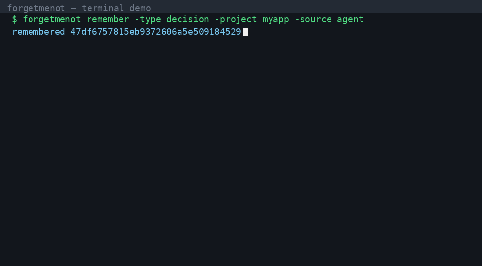

# forgetmenot 🧠

[](https://go.dev)
[](LICENSE)
[](https://github.com/iwanro/forgetmenot/actions/workflows/ci.yml)
[](https://goreportcard.com/report/github.com/iwanro/forgetmenot)

Persistent, structured, semantically searchable memory for AI agents, delivered as a local **MCP server** written in Go. One static binary, zero runtime dependencies, data stays on your machine.

Works with any MCP-capable agent: Claude Code, Cursor, Codex, OpenClaw and others.



## Why

Agents forget everything between sessions. You re-explain the same context, architectural decisions get lost, your preferences are ignored. `forgetmenot` gives your agents long-term memory: facts, decisions, preferences, entities, project context and episodes, stored locally and found semantically.

Positioning: **hygiene + trust** (dedupe, provenance, conflicts, intelligent forgetting) as first-class features, not add-ons. Details in [PRD.md](./PRD.md).

## Features (M3) ✨

- `memory.remember` - store a memory; automatic dedupe + conflict detection
- `memory.recall` - semantic search with similarity score, project/type filters, hides superseded memories, returns source + trust
- `memory.forget` - delete a memory
- `memory.update` - change content/type/project/importance/trust/metadata
- `memory.link` - relations between memories: `related`, `supersedes`, `part_of`
- `memory.conflicts` - list open conflicts
- `memory.resolve_conflict` - pick the winner; the loser becomes superseded
- `memory.stats` - memory and project counts
- Memory types: `fact`, `preference`, `decision`, `entity`, `context`, `episode`
- **Trust levels + sanitization (prompt-injection defense)**: `high`/`low` trust, control-char stripping, content length caps, `[UNTRUSTED]` flags in context
- **CLAUDE.md bridge**: `bridge export` (context into CLAUDE.md) + `bridge import` (facts from CLAUDE.md)
- **Memory budget**: `project_context -budget N` keeps session injection bounded
- Local embeddings (Ollama) or remote (OpenAI-compatible)
- Pure-Go SQLite: single static binary, no cgo, easy cross-compile
- CLI: `export`, `import`, `stats`, `list`, `eval`
- Eval harness with recall@k (20 queries), JSON output for CI

## Automatic operation (no manual steps) 🤖

`forgetmenot` is designed to run on its own. The user does not execute memory
commands; hooks, agent instructions and background maintenance do:

- **SessionStart hook** → `forgetmenot project_context` injects the project summary automatically
- **Stop hook** → `forgetmenot capture` saves a session summary as an episode automatically
- **Agent skill** (`.claude/skills/forgetmenot/SKILL.md`) teaches the agent to recall/remember on its own
- **`forgetmenot maintain`** (cron/daemon) applies decay automatically

One-time setup in a project:

```bash
forgetmenot setup     # writes .claude/settings.json with the hooks
```

## CLAUDE.md bridge

The agent's native memory (CLAUDE.md) stays in sync without manual work:

```bash
forgetmenot bridge export -path CLAUDE.md -project demo   # write project context into CLAUDE.md
forgetmenot bridge import -path CLAUDE.md -project demo   # ingest facts section into memory
```

The export writes a managed `<!-- forgetmenot:context -->` section. The
import reads bullets from a `<!-- forgetmenot:facts -->` section.

## CLI

```bash
forgetmenot remember -content "chose JWT for auth" -type decision -project demo  # store a memory (scripting/hooks)
forgetmenot project_context -project demo -budget 4000  # session-start context injection (used by hooks)
forgetmenot capture -project demo                       # session-end capture, reads summary from stdin (used by hooks)
forgetmenot maintain                                    # decay + future compression (cron-friendly)
forgetmenot setup                                       # write Claude Code hooks config
forgetmenot bridge export|import -path CLAUDE.md        # CLAUDE.md sync
forgetmenot stats                                       # memory + project counts
forgetmenot list -project demo                          # list memories
forgetmenot export -project demo > mem.json             # portable backup (with embeddings)
forgetmenot import < mem.json                           # restore
forgetmenot eval [-json]                                # seed + eval against real embeddings (Ollama)
```

## Benchmark

`forgetmenot eval` runs a fixed 20-query dataset and reports recall@k. The
dataset and runner live in `internal/eval` so the benchmark is reproducible:

```bash
forgetmenot eval -embed ollama          # against local Ollama embeddings
forgetmenot eval -embed openai -embed-url https://api.openai.com/v1 -embed-api-key $KEY
forgetmenot eval -json                  # machine-readable for CI
```

The dataset is verified in CI (hermetic bag-of-words embedder): **recall@k =
100% (20/20)** on the default dataset. Real-model results vary by embedder;
the same command above produces yours.

## Install 🚀

Requires Go 1.26+:

```bash
go install github.com/iwanro/forgetmenot/cmd/forgetmenot@latest
```

Or build locally:

```bash
make build
./bin/forgetmenot -version
```

### Embeddings

**Ollama (recommended, local):**

```bash
ollama pull nomic-embed-text
ollama serve  # default: http://localhost:11434
```

**Alternative, remote (OpenAI-compatible):**

```bash
forgetmenot -embed openai -embed-url https://api.openai.com/v1 -embed-api-key $OPENAI_API_KEY
```

## Claude Code setup

Add the server to `~/.claude.json` or to `.mcp.json` in your project:

```json
{
  "mcpServers": {
    "forgetmenot": {
      "command": "forgetmenot",
      "args": []
    }
  }
}
```

If `forgetmenot` is not in `$PATH`, use the absolute path to the binary. The database is created automatically at `$XDG_DATA_HOME/forgetmenot/memory.db` (default `~/.local/share/forgetmenot/memory.db`). Override with `-db`.

## Usage 💬

Once connected, your agent has the `memory.*` tools. Examples:

```
Remember that the backend is FastAPI on Python 3.12, DB Postgres 16.
→ the agent calls memory.remember

Continuing feature #42. Do you know the context?
→ the agent calls memory.recall and retrieves the relevant memories

Forget the memory about the old SMTP client.
→ the agent calls memory.forget
```

## Development

```bash
make test    # unit tests
make build   # static binary in ./bin
make lint    # go vet
```

Structure:

```
cmd/forgetmenot/    entry point, CLI subcommands
internal/memory/    core: model, SQLite store, service (remember/recall/...)
internal/embed/     embedding providers (Ollama, OpenAI-compat)
internal/mcpserver/ MCP layer (memory.* tools)
internal/eval/      eval harness (recall@k)
```

## Roadmap 🗺️

- M0 ✅: remember/recall/forget/update/stats, SQLite, embeddings
- M1 ✅: relations (link/supersedes), conflicts + resolution, CLI, eval harness
- M2 ✅: automatic operation (project_context, capture, hooks, agent skill), decay + maintain
- M3 ✅ (this release): trust levels + sanitization, CLAUDE.md bridge, memory budget, public benchmark
- M4: HTTP/SSE transport, plugins, Web UI, telemetry

## License

MIT.
